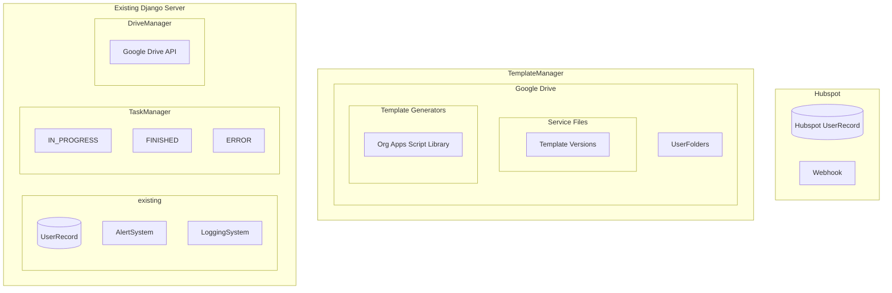
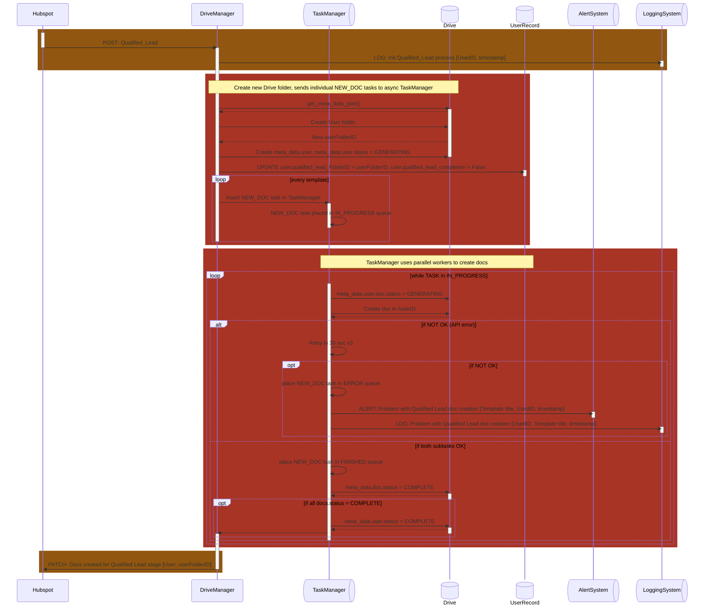

# Qualified Lead System

1. **Template Creation** Versioned Google doc templates are created/updated by Foundry.

2. **Qualified Lead Stage** Potential franchisee enters Qualified Lead stage on Hubspot.

3. **Doc Generation** Informational Google docs are generated based on current template versions.

    - populated per Hubspot info on potential franchisee
    - one of those documents will be a spreadsheet
    - organized in a new Drive folder named via Hubspot info

4. **Doc Sharing** Docs are shared with potential franchisee.
    - viewable/editable by potential franchisee and Foundry employees
    - sharing occurs via link in Hubspot email ie. sendNotificationEmails=False in Doc creation
    - generation and sharing should happen within a minute of potential franchisee entering Qualified Lead stage

5. **Sheet Completion** Potential franchisee fills in at least 3 of 6 specific empty fields in the generated Spreadsheet.

    - internal email is sent to Foundry staff with the potential franchisee's name, Drive folder
    - email should be sent within 5 minutes of potential franchisee completing 3 of 6 fields
    - apps script onEdit trigger to validate 3/6 fields completed

## System Components



## Pipeline Details

### Template Creation

```mermaid
sequenceDiagram
    actor Foundry
    participant Drive@{ "type" : "database" }
    participant TemplateManager
    participant DriveManager

    %% 1. Template versions are created
    rect rgb(14, 95, 93)
    activate Foundry
    Foundry->> Drive: Edit Template Generator Doc
    deactivate Foundry
    activate Drive
    deactivate Drive
    
    activate Foundry
    Foundry->> Drive: Publish Template menu option
    deactivate Foundry
    activate Drive
    deactivate Drive
    Drive->>TemplateManager:
    activate TemplateManager
    
    TemplateManager->> Drive: Move Old Template Version
    activate Drive
    TemplateManager->> Drive: Create New Template Version
    deactivate Drive
    opt if spreadsheet
        TemplateManager ->> DriveManager: POST sheetID
        activate DriveManager
        DriveManager->> Drive: Install 3/6 trigger on sheetID with API
        activate Drive
        deactivate Drive
        deactivate DriveManager
    end
    
    TemplateManager->> Drive: Update orgFolder/service_files/meta_data.json
    activate Drive
    deactivate Drive
    deactivate TemplateManager
    
    end
```



#### **TemplateManager**- Org-level app script library which handles the versioning and creation of templates

1. **Edit Template Version**: Foundry edits current template Doc in `Org/template_generators`
    - Feedback banner: Current Template not published.

2. **Publish Template Version**: `Publish Template` menu option allows Foundry to publish template version
    - Utilizes a service account
    - Template generators dynamically load scripts from an Org-level library
    - Spreadsheet template generator
        - sidebar to indicate trigger fields
        - DriveManager (on server) uses a Service Account w/ Google API to create an onEdit trigger
        - this pre-authorizes the apps script to call the server once 3/6 fields are filled in
    - TemplateManager script creates a new template version (```<template_name>_<version>```) in `/templates`
    - Old template version moved to `/templates/archive`
    - Updates `meta_data.json` w/ ID and name of current version

#### **Google Drive**- folder organization

```text
Org/
├── template_generators/
│   ├── Doc1
│   ├── Doc2
│   └── Sheet1
|
└── qualified_leads/
|   ├── lead.1@gmail.com
|   │   ├── Doc1
|   │   └── Doc2
|   │   └── Sheet1
|   |
|   └── lead.2@yahoo.com
|       ├── Doc1
|       └── Doc2
|       └── Sheet1
|
└── service_files/
    ├── meta_data.json
    |
    └── templates/
        ├── Doc1_v2
        ├── Doc2_v2
        ├── Sheet1_v2
        │
        └── archive/
            ├── Doc1_v1
            └── Doc2_v1
            └── Sheet1_v1
```

------

### Potential Franchisee Interactions

```mermaid
sequenceDiagram
    actor Potential Franchisee
    participant Hubspot
    participant DriveManager
    participant Drive@{ "type" : "database" }
    participant UserRecord@{ "type" : "database" }
    participant AlertSystem@{ "type" : "queue" }
    
    %% Qualified Lead stage on Hubspot
    rect rgb(145, 86, 15)
    activate Potential Franchisee
    Potential Franchisee->> Hubspot: Satisfies Qualified Lead stage
    activate Hubspot
    deactivate Potential Franchisee
    Hubspot ->> DriveManager: POST- Qualified_Lead 
    activate DriveManager
    DriveManager -->> Hubspot:
    deactivate Hubspot
    
    DriveManager->>UserRecord: user.qualified_lead = True<br>user.qualified_lead _completion= False
    activate UserRecord
    deactivate UserRecord
    deactivate DriveManager
    end

    rect rgb(168, 52, 37)
    note over Hubspot, DriveManager: Docs Creation for Potential Franchisee
    end

    %% Potential franchisee is sent an email
    rect rgb(145, 86, 15)
        DriveManager->>Hubspot: PATCH- Docs created for Qualified Lead stage [User, FolderID]
        Hubspot-->>DriveManager:
        activate DriveManager
        deactivate DriveManager
        activate Hubspot
        Hubspot->>Potential Franchisee: Hubspot email w/ tracking info and Doc links
        deactivate Hubspot
        activate Potential Franchisee
        deactivate Potential Franchisee
    end

    rect rgb(14, 95, 93)
        Potential Franchisee->>Drive: Potential Franchisee enters 3 of 6 fields in spreadsheet
        activate Drive
        activate Potential Franchisee
        deactivate Potential Franchisee
        Drive->>DriveManager:
        deactivate Drive
        activate DriveManager
        DriveManager->>UserRecord: get_qualified_lead_completion()
        activate UserRecord
        deactivate UserRecord
        UserRecord-->>DriveManager:
        opt if user.qualified_lead_completion = False
            
            DriveManager->>UserRecord: qualified_lead_completion = True
            activate UserRecord
            deactivate UserRecord
            DriveManager->>AlertSystem: ALERT: Email- Qualified Lead Completion [user, user folder link]
        end
        deactivate DriveManager

        activate AlertSystem
        deactivate AlertSystem
    end
        
```



#### **DriveManager**- Routes, Models added to existing DJANGO server or secondary server based on microservice or monolithic architecture

- Utilizes a service account

#### **AlertSystem**- Existing AlertSystem codes are extended to include a unique code and priority level for this new class of alert

#### **LoggingSystem**- Existing LoggingSystem codes are extended to include a unique code and priority level for this new class of alert

------

### Docs Creation for Potential Franchisee



#### **TaskManager**- Async Django task queue manager with three data stores: IN_PROGRESS, FINISHED, ERROR

#### **UserRecord**- Existing User tables are extended with a new table pairing Drive folder IDs with a user

------

## Hourly/Daily CRON vs manual intervention

Get all users.qualified_lead = True and users.qualified_lead_completion = False

1. Deal with incomplete Docs generation from API timeouts
2. Check spreadsheet in rare case script was deleted